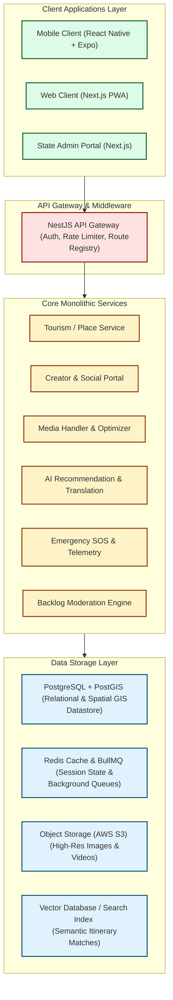
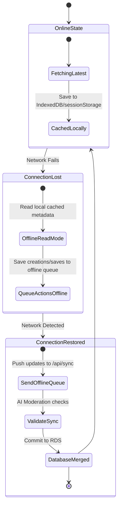

# CG Tourism Platform — System Architecture Documentation
## Chhattisgarh Tourism Digital Ecosystem

---

## 1. System Overview
### Platform Vision
The **CG Tourism Platform** is a secure, regional digital tourism operating system designed specifically for Chhattisgarh. It preserves tribal sovereignty, empowers local micro-economies, and provides robust, offline-capable travel infrastructure in areas with weak cellular networks.

Key capabilities include:
- **Tourism Discovery & GIS Mapping:** Precise georeferenced maps highlighting major tourist cascades, historic sites, and wildlife zones.
- **Cultural Storytelling & Folklore:** Immersive multimedia narrating the stories of tribal elders.
- **Community Creator Uploads:** A secure pipeline for local guides and rangers to submit unmapped wilderness sites.
- **Eco-Tourism carrying capacities:** Smart traffic thresholds preserving ecological reserves.
- **Sovereign Safety & Emergency SOS:** A secure telemetry link dispatching live SOS alerts to regional networks.

---

## 2. High-Level Architecture
The system employs a **Modular Monolith** architecture for the backend and a unified client workspace for frontends.



---

## 3. Core Technology Stack

### Frontend Monorepo Stack
- **Mobile Runtime & Framework:** React Native via Expo (supporting bare-metal workflow extensions for offline Bluetooth/mesh experiments).
- **Web App Framework:** Next.js (optimized with dynamic routing, Server Components, and Progressive Web App manifest parameters).
- **Language & Formatting:** TypeScript with strict type-safety checks.
- **Styling Design System:** TailwindCSS (with unified tokens in `tailwind.config.js`).
- **State Management:** Zustand (leveraging persistent local storage middleware for offline states).
- **Network Caching:** React Query (`@tanstack/react-query`) for seamless caching and background data revalidation.
- **Maps:** Mapbox SDK + Lightweight local SVG coordinate vector decks.

### Backend Stack
- **Runtime Environment:** Node.js v20.x LTS.
- **Application Framework:** NestJS (built-in TypeScript modules providing dependency injection and validation pipelines).
- **Database ORM:** Prisma (configured to manage schema models and migrations).
- **Relational Datastore:** PostgreSQL with spatial engine extension (**PostGIS**).
- **In-Memory Cache & Message Broker:** Redis (handling user session states and background task job queues via **BullMQ**).
- **Object Storage:** AWS S3 (integrated with cloud pipelines for video transcoding and compression).

---

## 4. Database Schema Blueprint (SQL/PostGIS DDL)

Below is the production-grade schema architecture defining geospatial geometry attributes mapping Chhattisgarh destinations:

```sql
-- Enable PostGIS spatial extension
CREATE EXTENSION IF NOT EXISTS postgis;

-- 1. User Classifications
CREATE TYPE user_role AS ENUM ('tourist', 'creator', 'admin', 'ranger');

CREATE TABLE users (
    id UUID PRIMARY KEY DEFAULT gen_random_uuid(),
    email VARCHAR(255) UNIQUE NOT NULL,
    password_hash VARCHAR(255) NOT NULL,
    full_name VARCHAR(150) NOT NULL,
    role user_role DEFAULT 'tourist',
    created_at TIMESTAMP WITH TIME ZONE DEFAULT CURRENT_TIMESTAMP,
    updated_at TIMESTAMP WITH TIME ZONE DEFAULT CURRENT_TIMESTAMP
);

-- 2. Creator Profiles
CREATE TYPE creator_status AS ENUM ('pending', 'approved', 'rejected');

CREATE TABLE creator_profiles (
    id UUID PRIMARY KEY DEFAULT gen_random_uuid(),
    user_id UUID NOT NULL REFERENCES users(id) ON DELETE CASCADE,
    social_handle VARCHAR(100) UNIQUE NOT NULL,
    social_platform VARCHAR(50) NOT NULL, -- 'instagram', 'youtube', 'expert_guide'
    verification_status creator_status DEFAULT 'pending',
    bio TEXT,
    verified_at TIMESTAMP WITH TIME ZONE,
    created_at TIMESTAMP WITH TIME ZONE DEFAULT CURRENT_TIMESTAMP
);

-- 3. Places & Geospatial Geometry
CREATE TYPE place_category AS ENUM ('waterfalls', 'forests', 'temples', 'villages');

CREATE TABLE places (
    id UUID PRIMARY KEY DEFAULT gen_random_uuid(),
    name VARCHAR(200) NOT NULL,
    category place_category NOT NULL,
    tagline VARCHAR(255),
    description TEXT NOT NULL,
    coordinates GEOMETRY(Point, 4326) NOT NULL, -- WGS 84 spatial reference identifier
    biodiversity_score INT CHECK (biodiversity_score BETWEEN 0 AND 100),
    crowd_capacity INT DEFAULT 500,
    rating NUMERIC(3, 2) DEFAULT 5.00,
    best_season VARCHAR(150),
    created_at TIMESTAMP WITH TIME ZONE DEFAULT CURRENT_TIMESTAMP,
    creator_id UUID REFERENCES creator_profiles(id) ON DELETE SET NULL
);

-- Index spatial geometry using GIST index for rapid spatial containment and radial search queries
CREATE INDEX places_coordinates_gist ON places USING GIST (coordinates);

-- 4. Lore & Storytelling
CREATE TABLE place_stories (
    id PRIMARY KEY DEFAULT gen_random_uuid(),
    place_id UUID NOT NULL REFERENCES places(id) ON DELETE CASCADE,
    title VARCHAR(200) NOT NULL,
    content TEXT NOT NULL,
    audio_narrative_url VARCHAR(255),
    tribal_relevance_notes TEXT,
    created_at TIMESTAMP WITH TIME ZONE DEFAULT CURRENT_TIMESTAMP
);

-- 5. Safety Protocols & Travel Guidance
CREATE TABLE place_safety (
    id PRIMARY KEY DEFAULT gen_random_uuid(),
    place_id UUID NOT NULL REFERENCES places(id) ON DELETE CASCADE,
    safety_warnings TEXT NOT NULL,
    eco_guidelines TEXT NOT NULL,
    required_gear VARCHAR(255)[], -- Array of recommended items
    last_updated TIMESTAMP WITH TIME ZONE DEFAULT CURRENT_TIMESTAMP
);
```

---

## 5. Offline-First Architecture & Sync Pipeline

To overcome weak cellular connectivity in deep forest zones (such as Bastar or Kanger Valley), the platform implements an offline-first caching pipeline.

### Data Sync State Machine


### Technical Caching Strategy
1. **Aggressive Cache Headers:** Static maps, SVG assets, and historical tribal lore are flagged with long-lived Cache-Control policies (e.g., `public, max-age=31536000`).
2. **Local Storage Compression:** Geospatial structures are compressed via JSON serialization and indexed inside a fast, locally accessible data store for millisecond read times.

---

## 6. Deployment Architecture
- **Web App Host:** Vercel (providing lightning-fast static CDN distributions).
- **Backend Infrastructure:** AWS ECS (Dockerized containers scaled dynamically based on visitor load levels).
- **Database Engine:** AWS RDS PostgreSQL Multi-AZ (guaranteeing high-availability backup clustering with active failover).
- **Global Content Delivery:** CloudFront CDN (caching rich images, tribal reels, and voice narration audio clips globally).
