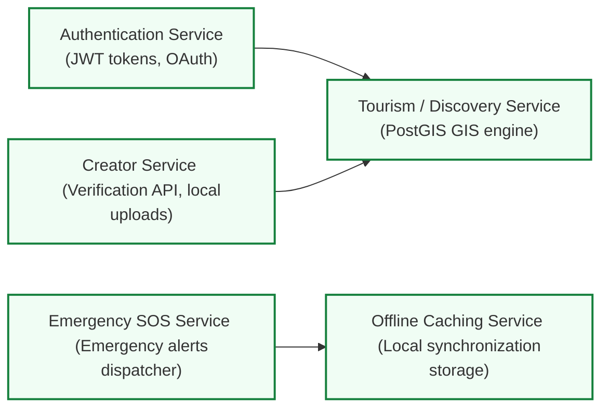

# CG Tourism Platform — Core Services Documentation
## Service Architecture, API Contracts & System Boundaries

---

## 1. Services Overview
The **CG Tourism Platform** is built using a highly decoupled modular service design. Each module manages a isolated set of responsibilities. This ensures simple microservice separation as traffic scales across Chhattisgarh's districts.

---

## 2. Core Service Classifications



### A. Authentication & User Profile Services
- **Auth Module:** Manages local login, registration, and federated OAuth profiles (Google, custom government ID accounts). Emits secure, signed JSON Web Tokens (JWT) containing visitor roles (`tourist`, `creator`, `ranger`, `admin`).
- **User Module:** Controls profile updates, bookmarks data preservation, and offline-cached circuit itineraries.

### B. Tourism Discovery & Geographic GIS Services
- **Tourism Module:** Executes high-speed PostGIS spatial queries (e.g. searching for tourist destinations within a 50km radius of Bastar coordinates). Handles seasonal recommendations based on monsoonal flooding cycles.
- **Place Detail Module:** Orchestrates deep cultural folklore text records and local audio narrative streaming URLs.

### C. Creator Studio Service
- **Verification Module:** Validates social handles (Instagram travel influencers, certified guides) and issues verification classifications.
- **Upload Module:** Stores and processes unmapped route coordinates, safety alerts, and cultural guides inside temporary staging collections prior to admin moderation review.

### D. Emergency Safety & SOS Service
- **SOS Dispatcher Module:** Establishes a redundant telemetry connection to local district offices (Bastar police, local medical networks). Implements dynamic background syncing to cache local police and hospital contacts on the visitor's device.

---

## 3. Service Communications Blueprint (API Interface Contracts)

Below are the exact request and response schemas defining communications between core platform services.

### A. Creator Coordinates Upload Contract
- **Endpoint:** `POST /api/v1/creator/places`
- **Request Payload:**
```json
{
  "name": "Kawardha Gorge Viewpoint",
  "category": "forests",
  "tagline": "Pristine green gap between Maikal peaks",
  "description": "A high-altitude overlook showing the dense sal canopies below. Access is via a 4km unpaved hiking track.",
  "coordinates": {
    "latitude": 22.1158,
    "longitude": 81.1542,
    "mapX": 30.5,
    "mapY": 30.0
  },
  "folklore": {
    "title": "Gond Clan legend of the Maikal canyon",
    "narrative": "Local villagers narrate tales of forest spirits protecting the deep green gorge streams."
  },
  "safety": {
    "warnings": "Strict flash flood risk during heavy monsoon seasons.",
    "rules": "Seek guidance from registered local clan guides before descending below.",
    "requiredGear": ["Rain canopy", "High-grip hiking boots", "Water flask"]
  }
}
```
- **Response Payload:**
```json
{
  "submissionId": "sub_928f0a2d48bf",
  "status": "pending_auto_check",
  "message": "Coordinates uploaded. Pushed to AI content validation pipeline.",
  "createdAt": "2026-05-19T03:09:12Z"
}
```

### B. Emergency SOS Telemetry Trigger Contract
- **Endpoint:** `POST /api/v1/emergency/sos`
- **Request Payload:**
```json
{
  "visitorId": "usr_771802a4bfed",
  "currentLocation": {
    "latitude": 19.2006,
    "longitude": 81.6961,
    "cachedAccuracy": "within_12_meters"
  },
  "deviceStatus": {
    "batteryLevel": 42,
    "signalStrengthBars": 1,
    "networkState": "intermittent_offline"
  },
  "customSOSMessage": "Medical emergency on downstream trail below waterfalls."
}
```
- **Response Payload:**
```json
{
  "sosTicketId": "sos_38402aef00d2",
  "actionStatus": "dispatched",
  "assignedStation": "Bastar District Emergency Response Center",
  "contactNumber": "+91-7782-222384",
  "estDispatchTimeMinutes": 18,
  "offlineSyncCode": "SOS-38402"
}
```
