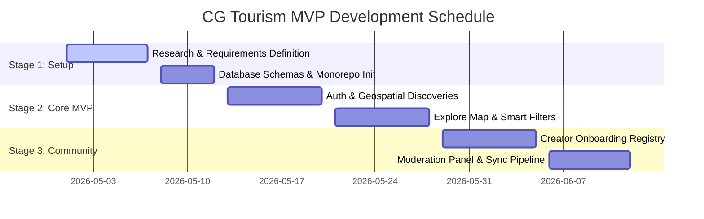

# CG Tourism Platform — Development Workflow Documentation
## Continuous Integration, Quality Guardrails & Onboarding

---

## 1. Development Philosophy
To build a sustainable digital platform for Chhattisgarh, engineering workflows must prioritize:
- **Tribal Sovereignty:** Rigid filters respecting local elders' policies before publishing custom GPS paths.
- **Offline Reliability:** Regular automated testing of bandwidth throttling and network interruption recovery.
- **Production-Grade Quality:** Strict TypeScript checks, unit assertions, and performance audits.

---

## 2. Product Development Lifecycles

---

## 3. Git Branching Strategy (GitFlow Specification)

To maintain absolute stability across our Next.js and Expo monorepo workspaces, developers must follow the branching guidelines below:

| Branch Pattern | Target Parent | Target Merge | Purpose | Deployment Target |
| :--- | :--- | :--- | :--- | :--- |
| `main` | *Root* | *None* | Production-ready stable release tag snapshots. | AWS Production ECS / PWA Edge CDN |
| `development` | `main` | `main` | Primary staging build target. Fuses all feature branches. | Staging Sandbox Environment |
| `feature/*` | `development` | `development` | Custom feature additions (e.g. `feature/offline-maps`). | Developer Local Sandbox |
| `hotfix/*` | `main` | `main` & `dev` | Urgent emergency resolutions for live production crashes. | Direct to Production Hotfix CDN |

---

## 4. Content Moderation State Machine

When a local creator submits unmapped forest trail coordinates or storytelling voice loops, the entry traverses a multi-layered quality control pipeline:

| Current Status | Trigger Action | Target Status | Validation Layer | Automated Action / Notification |
| :--- | :--- | :--- | :--- | :--- |
| **DRAFT** | Creator submits coordinates | **PENDING_AUTO_CHECK** | AI Content Classifier | Scans textual guidelines using LLM guardrails for inappropriate language. |
| **PENDING_AUTO_CHECK** | Passes AI verification | **PENDING_ADMIN** | Regional Moderation Panel | Dispatches standard push alarm to State Admin Portal dashboard. |
| **PENDING_AUTO_CHECK** | Fails AI verification | **FLAGGED_FOR_REVISION**| Automated Reject System | Flags violating sectors and sends automated email back to creator. |
| **PENDING_ADMIN** | Admin clicks Approve | **APPROVED** | Production Database | Commits geospatial geometry to PostGIS database, updating live SVG maps. |
| **PENDING_ADMIN** | Admin clicks Reject | **REJECTED** | Trash Archival Store | Sends custom moderation comments feedback note to Creator dashboard. |

---

## 5. Accessibility Compliance Checklist (WCAG 2.1 AA)

Since visitors will be navigating remote rural terrains under bright daylight conditions, strict readability, contrast, and layout systems must be respected:

1. **Vibrant Contrast Ratios (Rule 1.4.3):**
   - Ensure a minimum contrast ratio of `4.5:1` for regular screen body text.
   - Contrast between background surfaces (`#F4F1EA` Sand Beige) and text headers (`#133C24` Forest Emerald) must meet or exceed `7.0:1`.
2. **Dynamic Typography Scaling (Rule 1.4.4):**
   - Headings, lists, and travel guides must scale responsively up to `200%` width without clipping text boundaries.
3. **Optimized Touch Target Vectors (Rule 2.5.2):**
   - All interactive map selectors, SOS triggers, and filters must maintain a minimum physical touch surface size of `48px x 48px`.
4. **Offline Mode Visual Warnings:**
   - Clearly announce offline sync and local caching progress visually to minimize visitor confusion during network dropouts.
